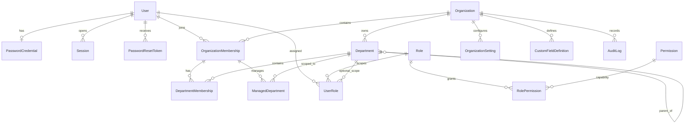

# Security and permissions

All authorization belongs in the API. Web controls improve usability but never grant or deny authority. Sprint 1 evaluates `permission AND scope AND target-policy AND delegation-policy AND active-status`. Assignment scopes are `SYSTEM`, `ORGANIZATION`, `DEPARTMENT`, and `SELF`; `MANAGED_DEPARTMENTS` is the derived actor view of active department assignments plus explicit managed-unit rows. Department membership never grants management authority.

The primary boundary is an HttpOnly opaque session cookie. The database stores only a SHA-256 token hash, expiry, revocation state, user, and organization membership. Credentials use bcrypt hashes; API responses, logs, audits, and frontend state never contain password hashes or raw session tokens. SameSite=Lax cookies and exact-origin checks protect cookie-authenticated mutations. Local development auth is disabled by default, production rejects it, and when enabled it still uses the same RBAC and tenant scope.

The API protects system role codes, prevents system role archival, prevents disabling the last active System Administrator or removing SYSTEM access, and rejects cross-organization role, scope, hierarchy, and department assignments. Role delegation requires a compatible scope, a delegable role below the actor tier, and a permission set contained in the actor's effective delegable permissions. System permissions and protected roles require SYSTEM scope. Organization Administrators cannot access protected system settings or mutate the permission catalogue.

Important mutations and audit records share a database transaction. Audit records are append-only because the API exposes only list access. They contain business changes or compact assignment metadata, never headers or secrets.

Validate every external input, expose safe errors, keep secrets out of Git, use least-privilege production credentials, and never let a future mobile or integration client bypass the API.

## Authority and target policy

- System Administrator: SYSTEM assignment, protected tier 100, platform organizations/settings/catalogue/audit plus tenant administration. There is no unaudited bypass.
- Organization Administrator: ORGANIZATION assignment, tier 80, all delegated non-system capabilities in one organization.
- Executive: ORGANIZATION assignment and explicit read or management capabilities; no implicit platform authority.
- Department Manager, Deputy, or Team Lead: DEPARTMENT assignment plus an active explicit managed-unit row. `includeChildren` expands only descendants of that row.
- Employee and custom roles: SELF or explicitly assigned scope. Job titles and unit names are data, never policy.

The shared target policy returns safe 404 responses outside visibility, blocks administrative self-mutation, protected targets, and equal-or-higher tiers, and audits rejected protected, tier, self, and delegation attempts. Role `administrationTier` is used only as a privilege/delegation ceiling; it never grants a capability.

## Per-user customization

The checkbox editor persists a named, visible custom access-profile role (`access_<user-id>`), not arbitrary permission strings or an invisible override. Its permissions must be active, delegable, and held by the actor; its assignment has an explicit scope and optional department. Saving an empty profile archives it and removes its assignment. Every lifecycle change is audited. Existing role-derived permissions remain visible and are not silently denied.

## Configuration and custom fields

System settings accept only a code-defined non-secret key catalogue and require SYSTEM scope. Organization settings use a separate code-defined catalogue. SMTP credentials, signing keys, session tokens, API tokens, and integration secrets remain environment/secret-store values.

Custom fields are metadata, never physical schema changes. Definitions support USER, ORGANIZATION_MEMBER, DEPARTMENT, and ROLE plus the eleven Sprint 1 value types. Values live in validated `customData` JSON. Scope/key uniqueness, select options, required values, entity ownership, visibility permissions, edit permissions, archive status, and actor target scope are enforced by the API.

## Identity and access ERD

